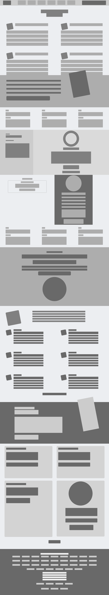

# Design-TearDown

This project is about cloning/building a heatmap of the [Smashing magazine](https://www.smashingmagazine.com/) website using HTML5/CSS3

## Built With

HTML

- Designed in Semantic HTML style.

CSS

- Use of Gradient background.
- Use of flex layout
- Use of grid layout
- Use of float

## Live Demo

[Live Demo Link](https://rawcdn.githack.com/uchennaanya/Design-TearDown/6670887ece2c5e9837697fe3d6e1172cd2a5d49b/index.html)

## Getting Started

\*_User has to clone the repository and run index.html file using any web browser_

## Authors

👤 **Uchenna Martins Anya**

- GitHub: [Uchenna Martins Anya](https://github.com/uchennaanya)
- Twitter: [@martinsanya19](https://twitter.com/martinsanya19)
- linkedIn: [Uchenna Anya](https://www.linkedin.com/in/uchenna-anya)

👤 **Divyesh Patel**

- GitHub: [@Div685](https://github.com/Div685)
- Twitter: [@div_685](https://twitter.com/div_685)
- LinkedIn: [Divyesh Patel](https://www.linkedin.com/in/divyesh-patel-2a15a6107)

## 🤝 Contributing

Contributions, issues, and feature requests are welcome!

Feel free to check the [issues page](issues/).

## Show your support

Give a ⭐️ if you like this project!

## Acknowledgments

- Fonts are imported from Google Fonts.

## 📝 License

This project is [MIT](lic.url) licensed.
